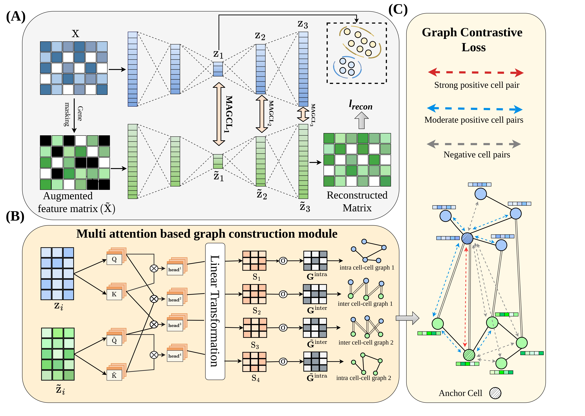

# scMAGCL
scMAGCL: Multi-level multi-attention based graph contrastive learning approach for single-cell transcriptomic analysis



scMAGCL encodes each cell's expression profile and a gene-masked copy of it with a shared autoencoder. At three depths (the latent space, the decoder's hidden layer and the reconstruction), multi-head attention builds cell-cell graphs:
- self-attention within each view gives the intra-cell graphs;
- cross-attention between the two views gives the inter-cell graphs.

A graph contrastive loss at each of these depths, together with a reconstruction loss, trains the model. Cells are then clustered with k-means in the 128-dimensional latent space.

---

## 📦 Requirements

- Python 3.8+
- torch (PyTorch) >= 1.9
- numpy >= 1.19
- pandas >= 1.1
- scikit-learn >= 0.24
- scipy >= 1.6
- h5py >= 3.0
- matplotlib >= 3.3
- umap-learn >= 0.5
- scanpy >= 1.8 and scikit-misc (only needed for `preprocess.py`)

> Install with `pip install -r requirements.txt`. For GPU training, install the CUDA build of PyTorch first by following the instructions at https://pytorch.org.

Tested with Python 3.11, PyTorch 2.7.1 (CUDA 12.8), NumPy 2.1.3, pandas 2.2.3, scikit-learn 1.5.2, h5py 3.13, umap-learn 0.5.7 and scanpy 1.11.1.

---

## 📁 Dataset

All of the processed datasets used for training and evaluation can be found at the following link:

https://zenodo.org/records/21346328

Each dataset is a single `.h5` file with two keys:

| Key | Shape | Content |
|-----|-------|---------|
| `X` | cells × genes | Normalized, log-transformed expression of the highly variable genes (float32) |
| `Y` | cells | Cell-type labels encoded as integers 0…k−1 (int64). The original names are stored in `Y.attrs['classes']` |

Two example datasets, Adam and Pollen, are included in `data/`.

```python
import h5py
with h5py.File('data/pollen.h5', 'r') as f:
    X, Y = f['X'][()], f['Y'][()]
```

---

## 🚀 Usage

A step-by-step example on the Adam dataset, from loading the data to the UMAP of the learned embedding, is in [`demo.ipynb`](demo.ipynb).

### 1. Preprocessing (only for your own raw data)

The provided datasets are already preprocessed. To use your own raw count matrix, run:

```bash
python preprocess.py --expr /path/to/raw_data.csv --labels /path/to/cell_label.csv --out ./data/my_data.h5
```

- `--expr`: a CSV with cells as rows, genes as columns and cell IDs in the first column.
- `--labels`: a CSV with one cell-type label per cell, in the same order; the label is read from the last column.

The script removes genes that are not expressed in any cell and keeps the top 2,500 highly variable genes (`--hvg` to change). It then normalizes each cell to 10,000 counts, applies log1p and saves the result as an `.h5` file with keys `X` and `Y`.

### 2. Training and evaluation

Train scMAGCL on a dataset by passing its path and a batch size:

```bash
python main.py --dataset ./data/pollen.h5 --batch_size 128
```

| Argument | Description |
|----------|-------------|
| `--dataset` | Path to an `.h5` file with keys `X` and `Y` (required) |
| `--batch_size` | Training batch size (default: `batch_size` in `config.py`) |

The batch sizes used in the paper depend on the number of cells: 128 for fewer than 4,000 cells, 512 for 4,000–8,000 cells and 1024 for larger datasets.

The script runs these steps:
1. It splits the cells into a training set (80%) and a test set (20%), stratified by cell type.
2. It trains scMAGCL on the training cells. After every epoch, it embeds the test cells.
3. It keeps the test-set embedding from the epoch with the lowest test reconstruction loss.
4. It clusters that embedding with k-means, where k is the number of cell types in `Y`.
5. It reports clustering accuracy (ACC), normalized mutual information (NMI) and adjusted Rand index (ARI).

### 3. Output

Results are written to the folder set by `save_dir` in `config.py` (default `results/`):

```
results/
├── results.csv                  # one row per run: dataset, seed, batch size, ACC, NMI, ARI, training time
└── <dataset name>/
    ├── cluster_labels.csv       # predicted cluster of each test cell
    └── umap_visualization.png   # UMAP of the embedding, coloured by predicted cluster and by true label
```

Each run appends a row to `results.csv`. The per-dataset files are overwritten by the next run on the same dataset.

---

## ⚙️ Configuration

The random seed and all hyperparameters are set in `config.py`:

| Parameter | Default | Description |
|-----------|---------|-------------|
| `mask_prob` | 0.25 | Probability of masking each gene in the augmented view |
| `lambda_recon` | 1.0 | Weight of the reconstruction loss |
| `lambda_contrast` | 1.0 | Weight of the graph contrastive loss |
| `alpha`, `beta` | 0.55, 0.4 | Weights of the two directions of the contrastive loss |
| `temperature` | 0.5 | Temperature of the contrastive loss |
| `lr` | 0.001 | Learning rate (Adam, cosine annealing) |
| `weight_decay` | 1e-4 | Weight decay |
| `epochs` | 200 | Number of training epochs |
| `batch_size` | 128 | Default batch size when `--batch_size` is not given |
| `grad_clip` | 1.0 | Maximum gradient norm |
| `test_size` | 0.2 | Fraction of cells held out for testing |
| `seed` | 42 | Random seed for the data split, model initialization and k-means |
| `save_dir` | `results` | Output folder |

---
